# Database ERD

This diagram reflects the current PostgreSQL schema defined by `src/database/migrations/001_core_schema.ts`.

```mermaid
erDiagram
    scheduler_runs {
        uuid id PK
        varchar job_name
        varchar trigger_type
        timestamptz triggered_at
        date cutoff_date
        varchar status
        varchar instance_id
        varchar lease_owner_token
        timestamptz started_at
        timestamptz completed_at
        timestamptz last_heartbeat_at
        integer eligible_count
        integer claimed_count
        integer succeeded_count
        integer failed_count
        integer skipped_count
        integer invoices_created_count
        varchar error_code
        varchar error_message
        timestamptz created_at
        timestamptz updated_at
    }

    subscriptions {
        uuid id PK
        varchar customer_reference
        varchar description
        varchar status
        varchar billing_state
        char currency
        numeric amount
        date start_date
        date next_billing_date
        smallint billing_anchor_day
        boolean anchor_is_month_end
        integer billing_failure_count
        timestamptz billing_retry_at
        varchar last_billing_error_code
        varchar last_billing_error_message
        uuid processing_run_id FK
        varchar processing_owner
        timestamptz processing_started_at
        timestamptz processing_expires_at
        integer version
        timestamptz created_at
        timestamptz updated_at
    }

    scheduler_locks {
        varchar lock_name PK
        varchar owner_token
        timestamptz acquired_at
        timestamptz lease_expires_at
        timestamptz heartbeat_at
        integer version
        timestamptz created_at
        timestamptz updated_at
    }

    invoices {
        uuid id PK
        varchar invoice_number UK
        uuid subscription_id FK
        varchar customer_reference
        date billing_period_start
        date billing_period_end
        date issue_date
        varchar status
        char currency
        numeric subtotal
        numeric tax_total
        numeric discount_total
        numeric total
        varchar idempotency_key UK
        uuid generated_by_run_id FK
        timestamptz created_at
    }

    invoice_items {
        uuid id PK
        uuid invoice_id FK
        varchar description
        numeric quantity
        numeric unit_price
        numeric line_total
        timestamptz created_at
    }

    scheduler_run_items {
        uuid id PK
        uuid run_id FK
        uuid subscription_id FK
        varchar result
        date before_billing_date
        date after_billing_date
        integer invoices_created
        varchar error_type
        varchar error_code
        varchar error_message
        timestamptz started_at
        timestamptz completed_at
        timestamptz created_at
    }

    scheduler_runs o|--o{ subscriptions : "claims"
    subscriptions ||--o{ invoices : "generates"
    scheduler_runs o|--o{ invoices : "generated by"
    invoices ||--o{ invoice_items : "contains"
    scheduler_runs ||--o{ scheduler_run_items : "records"
    subscriptions ||--o{ scheduler_run_items : "processed in"
```

## Relationship Notes

- `subscriptions.processing_run_id` optionally references `scheduler_runs.id` while a subscription is claimed for processing.
- Every invoice belongs to one subscription through `invoices.subscription_id`.
- `invoices.generated_by_run_id` optionally references the scheduler run that generated the invoice.
- Every invoice item belongs to one invoice through `invoice_items.invoice_id`.
- Every scheduler run item belongs to one scheduler run and one subscription.
- `scheduler_locks` is intentionally standalone; lock ownership is identified by `lock_name` and `owner_token`, not by a foreign key.

## Key Constraints and Indexes

| Name | Definition | Purpose |
| --- | --- | --- |
| `invoices_invoice_number_uniq` | `UNIQUE(invoice_number)` | Keeps human-readable invoice numbers unique. |
| `invoices_period_uniq` | `UNIQUE(subscription_id, billing_period_start, billing_period_end)` | Final database guard against duplicate billing-period invoices. |
| `invoices_idempotency_uniq` | `UNIQUE(idempotency_key)` | Enforces stable invoice idempotency. |
| `subscriptions_due_idx` | `(status, billing_state, next_billing_date, billing_retry_at, id)` | Supports deterministic due-subscription selection. |
| `subscriptions_claim_expiry_idx` | `processing_expires_at WHERE processing_run_id IS NOT NULL` | Supports expired-claim recovery. |
| `invoices_customer_date_idx` | `(customer_reference, issue_date DESC)` | Supports invoice history lookup. |
| `run_items_run_result_idx` | `(run_id, result)` | Supports run outcome filtering. |
| `runs_job_time_idx` | `(job_name, triggered_at DESC)` | Supports recent scheduler-run history. |
