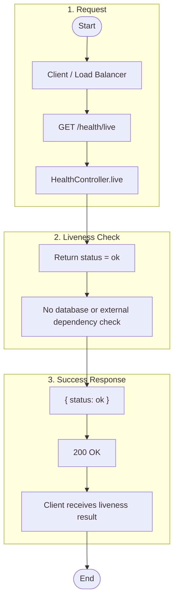
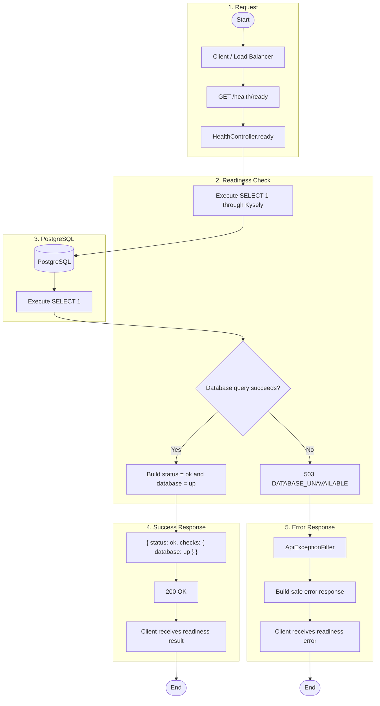

# Health Endpoint Flowcharts

## Index

- [GET /health/live](#get-healthlive)
- [GET /health/ready](#get-healthready)

## GET /health/live

Reports process liveness without checking PostgreSQL or other dependencies.

## GET /health/ready

Reports readiness by executing a minimal PostgreSQL connectivity query.

