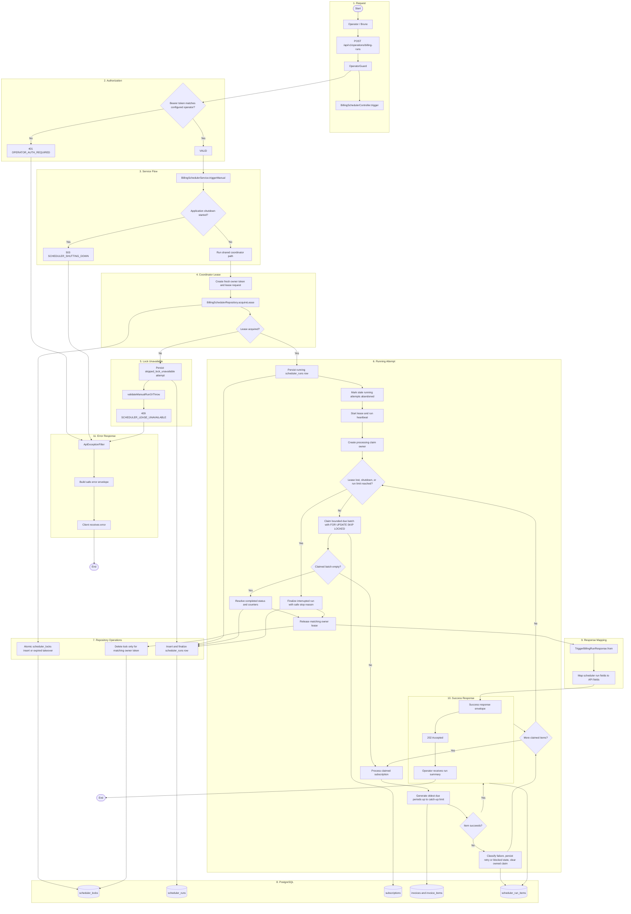
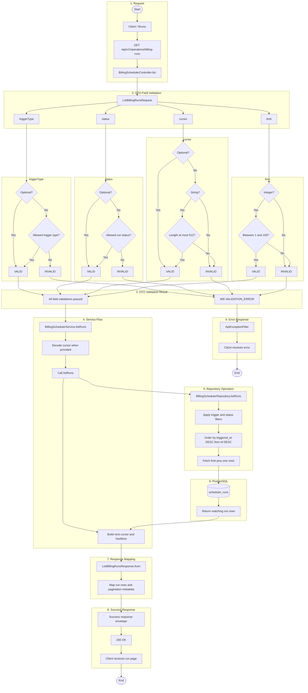
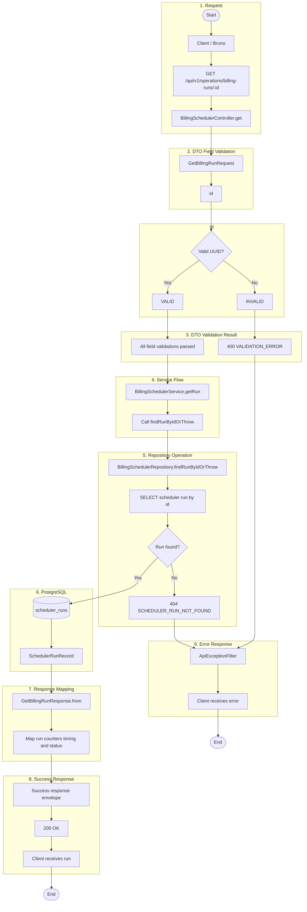

# Billing Scheduler Endpoint Flowcharts

## Index

- [POST /api/v1/operations/billing-runs](#post-apiv1operationsbilling-runs)
- [GET /api/v1/operations/billing-runs](#get-apiv1operationsbilling-runs)
- [GET /api/v1/operations/billing-runs/:id](#get-apiv1operationsbilling-runsid)
- [GET /api/v1/operations/billing-runs/:id/items](#get-apiv1operationsbilling-runsiditems)

## POST /api/v1/operations/billing-runs

## GET /api/v1/operations/billing-runs

## GET /api/v1/operations/billing-runs/:id

## GET /api/v1/operations/billing-runs/:id/items

```mermaid
flowchart TD

    subgraph REQUEST["1. Request"]
        direction TB

        START([Start])
        CLIENT["Client / Bruno"]
        GET["GET /api/v1/operations/billing-runs/:id/items"]
        CONTROLLER["BillingSchedulerController.items"]

        START --> CLIENT
        CLIENT --> GET
        GET --> CONTROLLER
    end

    subgraph DTO["2. DTO Field Validation"]
        direction TB

        PATH_DTO["GetBillingRunRequest"]
        QUERY_DTO["ListBillingRunItemsRequest"]
        ID["id"]
        RESULT["result"]
        ERROR_CODE["errorCode"]
        CURSOR["cursor"]
        LIMIT["limit"]

        PATH_DTO --> ID
        QUERY_DTO --> RESULT
        QUERY_DTO --> ERROR_CODE
        QUERY_DTO --> CURSOR
        QUERY_DTO --> LIMIT
    end

    CONTROLLER --> PATH_DTO
    CONTROLLER --> QUERY_DTO

    subgraph ID_TREE["id"]
        ID1{"Valid UUID?"}
        ID_VALID["VALID"]
        ID_INVALID["INVALID"]

        ID1 -- Yes --> ID_VALID
        ID1 -- No --> ID_INVALID
    end

    ID --> ID1

    subgraph RESULT_TREE["result"]
        R1{"Optional?"}
        R2{"Allowed run-item result?"}
        R_VALID["VALID"]
        R_INVALID["INVALID"]

        R1 -- Yes --> R_VALID
        R1 -- No --> R2
        R2 -- Yes --> R_VALID
        R2 -- No --> R_INVALID
    end

    RESULT --> R1

    subgraph ERROR_CODE_TREE["errorCode"]
        E1{"Optional?"}
        E2{"String?"}
        E3{"Length at most 80?"}
        E_VALID["VALID"]
        E_INVALID["INVALID"]

        E1 -- Yes --> E_VALID
        E1 -- No --> E2
        E2 -- No --> E_INVALID
        E2 -- Yes --> E3
        E3 -- Yes --> E_VALID
        E3 -- No --> E_INVALID
    end

    ERROR_CODE --> E1

    subgraph CURSOR_TREE["cursor"]
        C1{"Optional?"}
        C2{"String?"}
        C3{"Length at most 512?"}
        C_VALID["VALID"]
        C_INVALID["INVALID"]

        C1 -- Yes --> C_VALID
        C1 -- No --> C2
        C2 -- No --> C_INVALID
        C2 -- Yes --> C3
        C3 -- Yes --> C_VALID
        C3 -- No --> C_INVALID
    end

    CURSOR --> C1

    subgraph LIMIT_TREE["limit"]
        L1{"Integer?"}
        L2{"Between 1 and 100?"}
        L_VALID["VALID"]
        L_INVALID["INVALID"]

        L1 -- No --> L_INVALID
        L1 -- Yes --> L2
        L2 -- Yes --> L_VALID
        L2 -- No --> L_INVALID
    end

    LIMIT --> L1

    subgraph DTO_RESULT["3. DTO Validation Result"]
        ALL_VALID["All field validations passed"]
        VALIDATION_ERROR["400 VALIDATION_ERROR"]
    end

    ID_VALID --> ALL_VALID
    R_VALID --> ALL_VALID
    E_VALID --> ALL_VALID
    C_VALID --> ALL_VALID
    L_VALID --> ALL_VALID
    ID_INVALID --> VALIDATION_ERROR
    R_INVALID --> VALIDATION_ERROR
    E_INVALID --> VALIDATION_ERROR
    C_INVALID --> VALIDATION_ERROR
    L_INVALID --> VALIDATION_ERROR

    subgraph SERVICE["4. Service Flow"]
        ITEMS["BillingSchedulerService.listRunItems"]
        CHECK_RUN["Call findRunByIdOrThrow"]
        DECODE["Decode cursor when provided"]
        LIST_ITEMS["Call listRunItems"]
        PAGINATION["Build next cursor and hasMore"]

        ITEMS --> CHECK_RUN
        CHECK_RUN --> DECODE
        DECODE --> LIST_ITEMS
        LIST_ITEMS --> PAGINATION
    end

    ALL_VALID --> ITEMS

    subgraph REPOSITORY["5. Repository Operation"]
        FIND_RUN["BillingSchedulerRepository.findRunByIdOrThrow"]
        RUN_FOUND{"Run found?"}
        NOT_FOUND["404 SCHEDULER_RUN_NOT_FOUND"]
        REPO_ITEMS["BillingSchedulerRepository.listRunItems"]
        FILTERS["Apply result and errorCode filters"]
        ORDER["Order by started_at DESC then id DESC"]
        LIMIT_QUERY["Fetch limit plus one rows"]

        FIND_RUN --> RUN_FOUND
        RUN_FOUND -- No --> NOT_FOUND
        REPO_ITEMS --> FILTERS
        FILTERS --> ORDER
        ORDER --> LIMIT_QUERY
    end

    CHECK_RUN --> FIND_RUN
    RUN_FOUND -- Yes --> DECODE
    LIST_ITEMS --> REPO_ITEMS

    subgraph DATABASE["6. PostgreSQL"]
        RUNS[("scheduler_runs")]
        RUN_ITEMS[("scheduler_run_items")]
        ITEM_ROWS["Return matching run-item rows"]

        RUNS --> RUN_ITEMS
        RUN_ITEMS --> ITEM_ROWS
    end

    FIND_RUN --> RUNS
    LIMIT_QUERY --> RUN_ITEMS
    ITEM_ROWS --> PAGINATION

    subgraph RESPONSE_MAPPING["7. Response Mapping"]
        RESPONSE_DTO["ListBillingRunItemsResponse.from"]
        API_FIELDS["Map run-item rows and pagination metadata"]
        RESPONSE_DTO --> API_FIELDS
    end

    PAGINATION --> RESPONSE_DTO

    subgraph SUCCESS["8. Success Response"]
        SUCCESS_ENVELOPE["Success response envelope"]
        HTTP_200["200 OK"]
        SUCCESS_CLIENT["Client receives run-item page"]
        SUCCESS_ENVELOPE --> HTTP_200
        HTTP_200 --> SUCCESS_CLIENT
    end

    API_FIELDS --> SUCCESS_ENVELOPE

    subgraph ERROR["9. Error Response"]
        FILTER["ApiExceptionFilter"]
        ERROR_CLIENT["Client receives error"]
        FILTER --> ERROR_CLIENT
    end

    VALIDATION_ERROR --> FILTER
    NOT_FOUND --> FILTER
    SUCCESS_CLIENT --> END_SUCCESS([End])
    ERROR_CLIENT --> END_ERROR([End])
```

