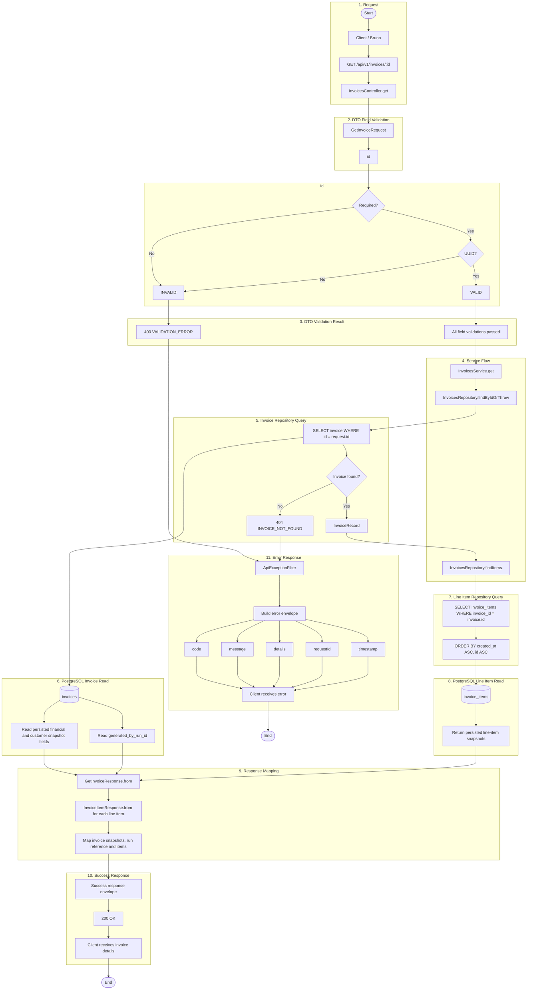

# Invoice Endpoint Flowcharts

## Index

- [GET /api/v1/invoices](#get-apiv1invoices)
- [GET /api/v1/invoices/:id](#get-apiv1invoicesid)

## GET /api/v1/invoices

Lists immutable invoice snapshots using optional filters and deterministic cursor pagination.

```mermaid
flowchart TD

    subgraph REQUEST["1. Request"]
        direction TB

        START([Start])
        CLIENT["Client / Bruno"]
        GET["GET /api/v1/invoices"]
        CONTROLLER["InvoicesController.list"]

        START --> CLIENT
        CLIENT --> GET
        GET --> CONTROLLER
    end

    subgraph DTO["2. DTO Field Validation"]
        direction TB

        REQUEST_DTO["ListInvoicesRequest"]
        SUBSCRIPTION["subscriptionId"]
        CUSTOMER["customerReference"]
        PERIOD_START["billingPeriodStart"]
        PERIOD_END["billingPeriodEnd"]
        ISSUE_DATE["issueDate"]
        CURSOR["cursor"]
        LIMIT["limit"]

        REQUEST_DTO --> SUBSCRIPTION
        REQUEST_DTO --> CUSTOMER
        REQUEST_DTO --> PERIOD_START
        REQUEST_DTO --> PERIOD_END
        REQUEST_DTO --> ISSUE_DATE
        REQUEST_DTO --> CURSOR
        REQUEST_DTO --> LIMIT
    end

    CONTROLLER --> REQUEST_DTO

    subgraph SUBSCRIPTION_TREE["subscriptionId"]
        S0{"Provided?"}
        S1{"UUID?"}
        S_VALID["VALID"]
        S_INVALID["INVALID"]

        S0 -- No --> S_VALID
        S0 -- Yes --> S1
        S1 -- Yes --> S_VALID
        S1 -- No --> S_INVALID
    end

    SUBSCRIPTION --> S0

    subgraph CUSTOMER_TREE["customerReference"]
        C0{"Provided?"}
        C1{"String?"}
        C2{"Not empty?"}
        C3{"Length <= 100?"}
        C_VALID["VALID"]
        C_INVALID["INVALID"]

        C0 -- No --> C_VALID
        C0 -- Yes --> C1
        C1 -- No --> C_INVALID
        C1 -- Yes --> C2
        C2 -- No --> C_INVALID
        C2 -- Yes --> C3
        C3 -- Yes --> C_VALID
        C3 -- No --> C_INVALID
    end

    CUSTOMER --> C0

    subgraph PERIOD_START_TREE["billingPeriodStart"]
        PS0{"Provided?"}
        PS1{"String?"}
        PS2{"YYYY-MM-DD format?"}
        PS3{"Valid ISO calendar date?"}
        PS_VALID["VALID"]
        PS_INVALID["INVALID"]

        PS0 -- No --> PS_VALID
        PS0 -- Yes --> PS1
        PS1 -- No --> PS_INVALID
        PS1 -- Yes --> PS2
        PS2 -- No --> PS_INVALID
        PS2 -- Yes --> PS3
        PS3 -- Yes --> PS_VALID
        PS3 -- No --> PS_INVALID
    end

    PERIOD_START --> PS0

    subgraph PERIOD_END_TREE["billingPeriodEnd"]
        PE0{"Provided?"}
        PE1{"String?"}
        PE2{"YYYY-MM-DD format?"}
        PE3{"Valid ISO calendar date?"}
        PE_VALID["VALID"]
        PE_INVALID["INVALID"]

        PE0 -- No --> PE_VALID
        PE0 -- Yes --> PE1
        PE1 -- No --> PE_INVALID
        PE1 -- Yes --> PE2
        PE2 -- No --> PE_INVALID
        PE2 -- Yes --> PE3
        PE3 -- Yes --> PE_VALID
        PE3 -- No --> PE_INVALID
    end

    PERIOD_END --> PE0

    subgraph ISSUE_DATE_TREE["issueDate"]
        I0{"Provided?"}
        I1{"String?"}
        I2{"YYYY-MM-DD format?"}
        I3{"Valid ISO calendar date?"}
        I_VALID["VALID"]
        I_INVALID["INVALID"]

        I0 -- No --> I_VALID
        I0 -- Yes --> I1
        I1 -- No --> I_INVALID
        I1 -- Yes --> I2
        I2 -- No --> I_INVALID
        I2 -- Yes --> I3
        I3 -- Yes --> I_VALID
        I3 -- No --> I_INVALID
    end

    ISSUE_DATE --> I0

    subgraph CURSOR_TREE["cursor"]
        CU0{"Provided?"}
        CU1{"String?"}
        CU2{"Length <= 512?"}
        CU_VALID["VALID"]
        CU_INVALID["INVALID"]

        CU0 -- No --> CU_VALID
        CU0 -- Yes --> CU1
        CU1 -- No --> CU_INVALID
        CU1 -- Yes --> CU2
        CU2 -- Yes --> CU_VALID
        CU2 -- No --> CU_INVALID
    end

    CURSOR --> CU0

    subgraph LIMIT_TREE["limit"]
        L1{"Integer after numeric transform?"}
        L2{"Between 1 and 100?"}
        L_VALID["VALID"]
        L_INVALID["INVALID"]

        L1 -- No --> L_INVALID
        L1 -- Yes --> L2
        L2 -- Yes --> L_VALID
        L2 -- No --> L_INVALID
    end

    LIMIT --> L1

    subgraph DTO_RESULT["3. DTO Validation Result"]
        ALL_VALID["All field validations passed"]
        VALIDATION_ERROR["400 VALIDATION_ERROR"]
    end

    S_VALID --> ALL_VALID
    C_VALID --> ALL_VALID
    PS_VALID --> ALL_VALID
    PE_VALID --> ALL_VALID
    I_VALID --> ALL_VALID
    CU_VALID --> ALL_VALID
    L_VALID --> ALL_VALID

    S_INVALID --> VALIDATION_ERROR
    C_INVALID --> VALIDATION_ERROR
    PS_INVALID --> VALIDATION_ERROR
    PE_INVALID --> VALIDATION_ERROR
    I_INVALID --> VALIDATION_ERROR
    CU_INVALID --> VALIDATION_ERROR
    L_INVALID --> VALIDATION_ERROR

    subgraph SERVICE["4. Service Flow"]
        direction TB

        SERVICE_LIST["InvoicesService.list"]
        CURSOR_PRESENT{"cursor provided?"}
        DECODE["CursorCodec.decodeOrThrow"]
        VALIDATE_CURSOR["isInvoiceListCursor"]
        CURSOR_SHAPE{"issueDate, UUID id and no extra keys?"}
        CURSOR_ERROR["400 INVALID_CURSOR"]
        REPOSITORY_LIST["InvoicesRepository.list"]

        SERVICE_LIST --> CURSOR_PRESENT
        CURSOR_PRESENT -- Yes --> DECODE
        DECODE --> VALIDATE_CURSOR
        VALIDATE_CURSOR --> CURSOR_SHAPE
        CURSOR_SHAPE -- No --> CURSOR_ERROR
        CURSOR_SHAPE -- Yes --> REPOSITORY_LIST
        CURSOR_PRESENT -- No --> REPOSITORY_LIST
    end

    ALL_VALID --> SERVICE_LIST

    subgraph REPOSITORY["5. Repository Query"]
        direction TB

        SELECT["SELECT invoices"]
        FILTER_SUBSCRIPTION["Apply subscription filter when provided"]
        FILTER_CUSTOMER["Apply customer reference filter when provided"]
        FILTER_PERIOD_START["Apply billing period start filter when provided"]
        FILTER_PERIOD_END["Apply billing period end filter when provided"]
        FILTER_ISSUE_DATE["Apply issue date filter when provided"]
        FILTER_CURSOR["Apply issueDate and id cursor predicate when provided"]
        ORDER["ORDER BY issue_date DESC, id DESC"]
        LIMIT_PLUS_ONE["LIMIT request.limit + 1"]

        SELECT --> FILTER_SUBSCRIPTION
        FILTER_SUBSCRIPTION --> FILTER_CUSTOMER
        FILTER_CUSTOMER --> FILTER_PERIOD_START
        FILTER_PERIOD_START --> FILTER_PERIOD_END
        FILTER_PERIOD_END --> FILTER_ISSUE_DATE
        FILTER_ISSUE_DATE --> FILTER_CURSOR
        FILTER_CURSOR --> ORDER
        ORDER --> LIMIT_PLUS_ONE
    end

    REPOSITORY_LIST --> SELECT

    subgraph DATABASE["6. PostgreSQL"]
        direction TB

        TABLE[("invoices")]
        ROWS["Return ordered InvoiceRecord rows"]

        TABLE --> ROWS
    end

    LIMIT_PLUS_ONE --> TABLE

    subgraph PAGINATION["7. Pagination Result"]
        direction TB

        HAS_MORE{"rows.length > request.limit?"}
        ITEMS["Visible items = first request.limit rows"]
        LAST["Read last visible row"]
        ENCODE["CursorCodec.encode issueDate and id"]
        NEXT_CURSOR["nextCursor = encoded cursor"]
        NO_CURSOR["nextCursor = null"]
        META["Build pagination: nextCursor and hasMore"]

        HAS_MORE -- Yes --> ITEMS
        ITEMS --> LAST
        LAST --> ENCODE
        ENCODE --> NEXT_CURSOR
        NEXT_CURSOR --> META
        HAS_MORE -- No --> ITEMS
        ITEMS --> NO_CURSOR
        NO_CURSOR --> META
    end

    ROWS --> HAS_MORE

    subgraph RESPONSE_MAPPING["8. Response Mapping"]
        direction TB

        RESPONSE_DTO["ListInvoicesResponse.from"]
        ITEM_DTO["ListInvoiceItemResponse.from for each invoice"]
        PAGINATION_DTO["CursorPaginationMetaResponse.from"]
        API_FIELDS["Build items and pagination response"]

        RESPONSE_DTO --> ITEM_DTO
        RESPONSE_DTO --> PAGINATION_DTO
        ITEM_DTO --> API_FIELDS
        PAGINATION_DTO --> API_FIELDS
    end

    ITEMS --> RESPONSE_DTO
    META --> RESPONSE_DTO

    subgraph SUCCESS["9. Success Response"]
        direction TB

        SUCCESS_ENVELOPE["Success response envelope"]
        HTTP_200["200 OK"]
        SUCCESS_CLIENT["Client receives invoice page"]

        SUCCESS_ENVELOPE --> HTTP_200
        HTTP_200 --> SUCCESS_CLIENT
    end

    API_FIELDS --> SUCCESS_ENVELOPE

    subgraph ERROR_FLOW["10. Error Response"]
        direction TB

        ERROR_HANDLER["ApiExceptionFilter"]
        ERROR_ENVELOPE["Build error envelope"]
        ERROR_CODE["code"]
        ERROR_MESSAGE["message"]
        ERROR_DETAILS["details"]
        REQUEST_ID["requestId"]
        TIMESTAMP["timestamp"]
        ERROR_CLIENT["Client receives error"]

        ERROR_HANDLER --> ERROR_ENVELOPE
        ERROR_ENVELOPE --> ERROR_CODE
        ERROR_ENVELOPE --> ERROR_MESSAGE
        ERROR_ENVELOPE --> ERROR_DETAILS
        ERROR_ENVELOPE --> REQUEST_ID
        ERROR_ENVELOPE --> TIMESTAMP
        ERROR_CODE --> ERROR_CLIENT
        ERROR_MESSAGE --> ERROR_CLIENT
        ERROR_DETAILS --> ERROR_CLIENT
        REQUEST_ID --> ERROR_CLIENT
        TIMESTAMP --> ERROR_CLIENT
    end

    VALIDATION_ERROR --> ERROR_HANDLER
    CURSOR_ERROR --> ERROR_HANDLER

    SUCCESS_CLIENT --> END_SUCCESS([End])
    ERROR_CLIENT --> END_ERROR([End])
```

## GET /api/v1/invoices/:id

Returns one immutable invoice snapshot with its line items and scheduler run reference.

