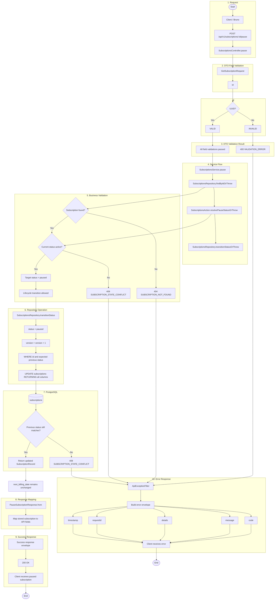
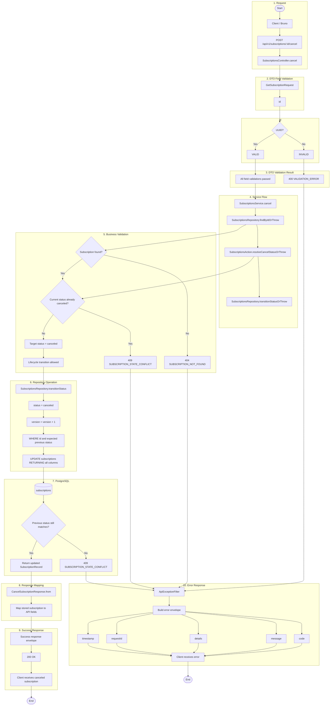

# Subscription Endpoint Flowcharts

## Index

- [POST /api/v1/subscriptions](#post-apiv1subscriptions)
- [PATCH /api/v1/subscriptions/:id](#patch-apiv1subscriptionsid)
- [POST /api/v1/subscriptions/:id/billing-retry](#post-apiv1subscriptionsidbilling-retry)
- [POST /api/v1/subscriptions/:id/pause](#post-apiv1subscriptionsidpause)
- [POST /api/v1/subscriptions/:id/resume](#post-apiv1subscriptionsidresume)
- [POST /api/v1/subscriptions/:id/cancel](#post-apiv1subscriptionsidcancel)
- [GET /api/v1/subscriptions](#get-apiv1subscriptions)
- [GET /api/v1/subscriptions/:id](#get-apiv1subscriptionsid)

## POST /api/v1/subscriptions

Creates an active, ready subscription after request-field and cross-field schedule validation.

```mermaid
flowchart TD


    subgraph REQUEST["1. Request"]
        direction TB

        START([Start])
        CLIENT["Client / Bruno"]
        POST["POST /api/v1/subscriptions"]
        CONTROLLER["SubscriptionsController.create"]

        START --> CLIENT
        CLIENT --> POST
        POST --> CONTROLLER
    end


    subgraph DTO["2. DTO Field Validation"]
        direction TB

        REQUEST_DTO["CreateSubscriptionRequest"]

        CUSTOMER["customerReference"]
        DESCRIPTION["description"]
        AMOUNT["amount"]
        CURRENCY["currency"]
        START_DATE["startDate"]
        FIRST_DATE["firstBillingDate"]
        ANCHOR_DAY["billingAnchorDay"]
        MONTH_END["anchorIsMonthEnd"]

        REQUEST_DTO --> CUSTOMER
        REQUEST_DTO --> DESCRIPTION
        REQUEST_DTO --> AMOUNT
        REQUEST_DTO --> CURRENCY
        REQUEST_DTO --> START_DATE
        REQUEST_DTO --> FIRST_DATE
        REQUEST_DTO --> ANCHOR_DAY
        REQUEST_DTO --> MONTH_END
    end

    CONTROLLER --> REQUEST_DTO


    subgraph CUSTOMER_TREE["customerReference"]
        C1{"Required?"}
        C2{"String?"}

        C_VALID["VALID"]
        C_INVALID["INVALID"]

        C1 -- No --> C_INVALID
        C1 -- Yes --> C2

        C2 -- Yes --> C_VALID
        C2 -- No --> C_INVALID
    end

    CUSTOMER --> C1


    subgraph DESCRIPTION_TREE["description"]
        D1{"Allowed?"}
        D2{"String?"}

        D_VALID["VALID"]
        D_INVALID["INVALID"]

        D1 -- No --> D_INVALID
        D1 -- Yes --> D2

        D2 -- Yes --> D_VALID
        D2 -- No --> D_INVALID
    end

    DESCRIPTION --> D1


    subgraph AMOUNT_TREE["amount"]
        A1{"String?"}
        A2{"Decimal format valid?"}
        A3{"Greater than 0?"}
        A4{"Precision valid?"}

        A_VALID["VALID"]
        A_INVALID["INVALID"]

        A1 -- No --> A_INVALID
        A1 -- Yes --> A2

        A2 -- No --> A_INVALID
        A2 -- Yes --> A3

        A3 -- No --> A_INVALID
        A3 -- Yes --> A4

        A4 -- Yes --> A_VALID
        A4 -- No --> A_INVALID
    end

    AMOUNT --> A1


    subgraph CURRENCY_TREE["currency"]
        CU1{"String?"}
        CU2{"Length = 3?"}
        CU3{"Uppercase letters?"}

        CU_VALID["VALID"]
        CU_INVALID["INVALID"]

        CU1 -- No --> CU_INVALID
        CU1 -- Yes --> CU2

        CU2 -- No --> CU_INVALID
        CU2 -- Yes --> CU3

        CU3 -- Yes --> CU_VALID
        CU3 -- No --> CU_INVALID
    end

    CURRENCY --> CU1


    subgraph START_DATE_TREE["startDate"]
        SD1{"String?"}
        SD2{"YYYY-MM-DD format?"}
        SD3{"Valid calendar date?"}

        SD_VALID["VALID"]
        SD_INVALID["INVALID"]

        SD1 -- No --> SD_INVALID
        SD1 -- Yes --> SD2

        SD2 -- No --> SD_INVALID
        SD2 -- Yes --> SD3

        SD3 -- Yes --> SD_VALID
        SD3 -- No --> SD_INVALID
    end

    START_DATE --> SD1


    subgraph FIRST_DATE_TREE["firstBillingDate"]
        FD1{"String?"}
        FD2{"YYYY-MM-DD format?"}
        FD3{"Valid calendar date?"}

        FD_VALID["VALID"]
        FD_INVALID["INVALID"]

        FD1 -- No --> FD_INVALID
        FD1 -- Yes --> FD2

        FD2 -- No --> FD_INVALID
        FD2 -- Yes --> FD3

        FD3 -- Yes --> FD_VALID
        FD3 -- No --> FD_INVALID
    end

    FIRST_DATE --> FD1


    subgraph ANCHOR_TREE["billingAnchorDay"]
        BA1{"Integer?"}
        BA2{"At least 1?"}
        BA3{"At most 31?"}

        BA_VALID["VALID"]
        BA_INVALID["INVALID"]

        BA1 -- No --> BA_INVALID
        BA1 -- Yes --> BA2

        BA2 -- No --> BA_INVALID
        BA2 -- Yes --> BA3

        BA3 -- Yes --> BA_VALID
        BA3 -- No --> BA_INVALID
    end

    ANCHOR_DAY --> BA1


    subgraph MONTH_END_TREE["anchorIsMonthEnd"]
        ME1{"Boolean?"}

        ME_VALID["VALID"]
        ME_INVALID["INVALID"]

        ME1 -- Yes --> ME_VALID
        ME1 -- No --> ME_INVALID
    end

    MONTH_END --> ME1


    subgraph DTO_RESULT["3. DTO Validation Result"]
        ALL_VALID["All field validations passed"]
        VALIDATION_ERROR["400 VALIDATION_ERROR"]
    end

    C_VALID --> ALL_VALID
    D_VALID --> ALL_VALID
    A_VALID --> ALL_VALID
    CU_VALID --> ALL_VALID
    SD_VALID --> ALL_VALID
    FD_VALID --> ALL_VALID
    BA_VALID --> ALL_VALID
    ME_VALID --> ALL_VALID

    C_INVALID --> VALIDATION_ERROR
    D_INVALID --> VALIDATION_ERROR
    A_INVALID --> VALIDATION_ERROR
    CU_INVALID --> VALIDATION_ERROR
    SD_INVALID --> VALIDATION_ERROR
    FD_INVALID --> VALIDATION_ERROR
    BA_INVALID --> VALIDATION_ERROR
    ME_INVALID --> VALIDATION_ERROR


    subgraph SERVICE["4. Service Flow"]
        direction TB

        SERVICE_CREATE["SubscriptionsService.create"]
        ACTION_CALL["Call validateCreateOrThrow"]

        SERVICE_CREATE --> ACTION_CALL
    end

    ALL_VALID --> SERVICE_CREATE


    subgraph BUSINESS["5. Business Validation"]
        direction TB

        ACTION["SubscriptionsAction"]

        DATE_ORDER{"firstBillingDate >= startDate?"}

        INVALID_DATES["422 INVALID_SUBSCRIPTION_DATES"]

        PARSE_DATE["Read year, month and day"]
        MONTH_DAYS["Calculate daysInMonth"]

        MODE{"anchorIsMonthEnd?"}

        MONTH_END_EXPECTED["expectedDay = month last day"]
        NORMAL_EXPECTED["expectedDay = min billingAnchorDay and month last day"]

        MONTH_END_MATCH{"billing day = expectedDay?"}
        NORMAL_MATCH{"billing day = expectedDay?"}

        INVALID_ANCHOR["422 INVALID_BILLING_ANCHOR"]

        BUSINESS_VALID["Business validation passed"]

        ACTION --> DATE_ORDER

        DATE_ORDER -- No --> INVALID_DATES
        DATE_ORDER -- Yes --> PARSE_DATE

        PARSE_DATE --> MONTH_DAYS
        MONTH_DAYS --> MODE

        MODE -- Yes --> MONTH_END_EXPECTED
        MONTH_END_EXPECTED --> MONTH_END_MATCH

        MONTH_END_MATCH -- No --> INVALID_ANCHOR
        MONTH_END_MATCH -- Yes --> BUSINESS_VALID

        MODE -- No --> NORMAL_EXPECTED
        NORMAL_EXPECTED --> NORMAL_MATCH

        NORMAL_MATCH -- No --> INVALID_ANCHOR
        NORMAL_MATCH -- Yes --> BUSINESS_VALID
    end

    ACTION_CALL --> ACTION


    subgraph INITIAL_STATE["6. Initialize Subscription State"]
        direction TB

        INIT["Prepare subscription"]
        ACTIVE["status = active"]
        READY["billingState = ready"]
        NEXT_DATE["nextBillingDate = firstBillingDate"]

        INIT --> ACTIVE
        ACTIVE --> READY
        READY --> NEXT_DATE
    end

    BUSINESS_VALID --> INIT


    subgraph REPOSITORY["7. Repository Operation"]
        direction TB

        REPO_CREATE["SubscriptionsRepository.createOrThrow"]
        MAP["Map request to DB columns"]
        DB_VALUES["Set initial persistence values"]
        INSERT["INSERT INTO subscriptions<br/>RETURNING all columns"]

        REPO_CREATE --> MAP
        MAP --> DB_VALUES
        DB_VALUES --> INSERT
    end

    NEXT_DATE --> REPO_CREATE


    subgraph DATABASE["8. PostgreSQL"]
        direction TB

        TABLE[("subscriptions")]

        DB_DEFAULTS["Apply database defaults"]

        CREATED_AT["created_at"]
        UPDATED_AT["updated_at"]
        VERSION["version"]

        INSERTED_ROW["Return inserted row"]

        TABLE --> DB_DEFAULTS

        DB_DEFAULTS --> CREATED_AT
        DB_DEFAULTS --> UPDATED_AT
        DB_DEFAULTS --> VERSION

        CREATED_AT --> INSERTED_ROW
        UPDATED_AT --> INSERTED_ROW
        VERSION --> INSERTED_ROW
    end

    INSERT --> TABLE


    subgraph REPOSITORY_RESULT["9. Repository Result"]
        direction TB

        EXECUTE["executeTakeFirstOrThrow"]
        RECORD["SubscriptionRecord"]

        EXECUTE --> RECORD
    end

    INSERTED_ROW --> EXECUTE


    subgraph RESPONSE_MAPPING["10. Response Mapping"]
        direction TB

        RESPONSE_DTO["CreateSubscriptionResponse.from"]
        API_FIELDS["Map DB fields to API fields"]

        RESPONSE_DTO --> API_FIELDS
    end

    RECORD --> RESPONSE_DTO


    subgraph SUCCESS["11. Success Response"]
        direction TB

        SUCCESS_ENVELOPE["Success response envelope"]
        HTTP_201["201 Created"]
        SUCCESS_CLIENT["Client receives created subscription"]

        SUCCESS_ENVELOPE --> HTTP_201
        HTTP_201 --> SUCCESS_CLIENT
    end

    API_FIELDS --> SUCCESS_ENVELOPE


    subgraph ERROR_FLOW["12. Error Response"]
        direction TB

        ERROR_HANDLER["ApiExceptionFilter"]
        ERROR_ENVELOPE["Build error envelope"]

        ERROR_CODE["code"]
        ERROR_MESSAGE["message"]
        ERROR_DETAILS["details"]
        REQUEST_ID["requestId"]
        TIMESTAMP["timestamp"]

        ERROR_CLIENT["Client receives error"]

        ERROR_HANDLER --> ERROR_ENVELOPE

        ERROR_ENVELOPE --> ERROR_CODE
        ERROR_ENVELOPE --> ERROR_MESSAGE
        ERROR_ENVELOPE --> ERROR_DETAILS
        ERROR_ENVELOPE --> REQUEST_ID
        ERROR_ENVELOPE --> TIMESTAMP

        ERROR_CODE --> ERROR_CLIENT
        ERROR_MESSAGE --> ERROR_CLIENT
        ERROR_DETAILS --> ERROR_CLIENT
        REQUEST_ID --> ERROR_CLIENT
        TIMESTAMP --> ERROR_CLIENT
    end

    VALIDATION_ERROR --> ERROR_HANDLER
    INVALID_DATES --> ERROR_HANDLER
    INVALID_ANCHOR --> ERROR_HANDLER


    SUCCESS_CLIENT --> END_SUCCESS([End])
    ERROR_CLIENT --> END_ERROR([End])
```

## PATCH /api/v1/subscriptions/:id

Updates allowed commercial or schedule fields while enforcing version and active-claim protection.

```mermaid
flowchart TD

    subgraph REQUEST["1. Request"]
        direction TB

        START([Start])
        CLIENT["Client / Bruno"]
        PATCH["PATCH /api/v1/subscriptions/:id"]
        CONTROLLER["SubscriptionsController.update"]

        START --> CLIENT
        CLIENT --> PATCH
        PATCH --> CONTROLLER
    end

    subgraph DTO["2. DTO Field Validation"]
        direction TB

        PARAM_DTO["GetSubscriptionRequest"]
        BODY_DTO["UpdateSubscriptionRequest"]

        ID["id"]
        DESCRIPTION["description"]
        AMOUNT["amount"]
        CURRENCY["currency"]
        NEXT_DATE["nextBillingDate"]
        ANCHOR_DAY["billingAnchorDay"]
        MONTH_END["anchorIsMonthEnd"]
        VERSION["version"]

        PARAM_DTO --> ID
        BODY_DTO --> DESCRIPTION
        BODY_DTO --> AMOUNT
        BODY_DTO --> CURRENCY
        BODY_DTO --> NEXT_DATE
        BODY_DTO --> ANCHOR_DAY
        BODY_DTO --> MONTH_END
        BODY_DTO --> VERSION
    end

    CONTROLLER --> PARAM_DTO
    CONTROLLER --> BODY_DTO

    subgraph ID_TREE["id"]
        ID1{"UUID?"}
        ID_VALID["VALID"]
        ID_INVALID["INVALID"]

        ID1 -- Yes --> ID_VALID
        ID1 -- No --> ID_INVALID
    end

    ID --> ID1

    subgraph DESCRIPTION_TREE["description"]
        D0{"Provided?"}
        D1{"String?"}
        D2{"Not empty?"}
        D3{"Length <= 255?"}
        D_VALID["VALID"]
        D_INVALID["INVALID"]

        D0 -- No --> D_VALID
        D0 -- Yes --> D1
        D1 -- No --> D_INVALID
        D1 -- Yes --> D2
        D2 -- No --> D_INVALID
        D2 -- Yes --> D3
        D3 -- Yes --> D_VALID
        D3 -- No --> D_INVALID
    end

    DESCRIPTION --> D0

    subgraph AMOUNT_TREE["amount"]
        A0{"Provided?"}
        A1{"String?"}
        A2{"Positive fixed-precision decimal?"}
        A_VALID["VALID"]
        A_INVALID["INVALID"]

        A0 -- No --> A_VALID
        A0 -- Yes --> A1
        A1 -- No --> A_INVALID
        A1 -- Yes --> A2
        A2 -- Yes --> A_VALID
        A2 -- No --> A_INVALID
    end

    AMOUNT --> A0

    subgraph CURRENCY_TREE["currency"]
        C0{"Provided?"}
        C1{"String?"}
        C2{"Three uppercase letters?"}
        C_VALID["VALID"]
        C_INVALID["INVALID"]

        C0 -- No --> C_VALID
        C0 -- Yes --> C1
        C1 -- No --> C_INVALID
        C1 -- Yes --> C2
        C2 -- Yes --> C_VALID
        C2 -- No --> C_INVALID
    end

    CURRENCY --> C0

    subgraph NEXT_DATE_TREE["nextBillingDate"]
        N0{"Provided?"}
        N1{"String?"}
        N2{"YYYY-MM-DD format?"}
        N3{"Valid ISO calendar date?"}
        N_VALID["VALID"]
        N_INVALID["INVALID"]

        N0 -- No --> N_VALID
        N0 -- Yes --> N1
        N1 -- No --> N_INVALID
        N1 -- Yes --> N2
        N2 -- No --> N_INVALID
        N2 -- Yes --> N3
        N3 -- Yes --> N_VALID
        N3 -- No --> N_INVALID
    end

    NEXT_DATE --> N0

    subgraph ANCHOR_TREE["billingAnchorDay"]
        BA0{"Provided?"}
        BA1{"Integer?"}
        BA2{"Between 1 and 31?"}
        BA_VALID["VALID"]
        BA_INVALID["INVALID"]

        BA0 -- No --> BA_VALID
        BA0 -- Yes --> BA1
        BA1 -- No --> BA_INVALID
        BA1 -- Yes --> BA2
        BA2 -- Yes --> BA_VALID
        BA2 -- No --> BA_INVALID
    end

    ANCHOR_DAY --> BA0

    subgraph MONTH_END_TREE["anchorIsMonthEnd"]
        ME0{"Provided?"}
        ME1{"Boolean?"}
        ME_VALID["VALID"]
        ME_INVALID["INVALID"]

        ME0 -- No --> ME_VALID
        ME0 -- Yes --> ME1
        ME1 -- Yes --> ME_VALID
        ME1 -- No --> ME_INVALID
    end

    MONTH_END --> ME0

    subgraph VERSION_TREE["version"]
        V1{"Integer?"}
        V2{"At least 1?"}
        V_VALID["VALID"]
        V_INVALID["INVALID"]

        V1 -- No --> V_INVALID
        V1 -- Yes --> V2
        V2 -- Yes --> V_VALID
        V2 -- No --> V_INVALID
    end

    VERSION --> V1

    subgraph DTO_RESULT["3. DTO Validation Result"]
        ALL_VALID["All field validations passed"]
        VALIDATION_ERROR["400 VALIDATION_ERROR"]
    end

    ID_VALID --> ALL_VALID
    D_VALID --> ALL_VALID
    A_VALID --> ALL_VALID
    C_VALID --> ALL_VALID
    N_VALID --> ALL_VALID
    BA_VALID --> ALL_VALID
    ME_VALID --> ALL_VALID
    V_VALID --> ALL_VALID

    ID_INVALID --> VALIDATION_ERROR
    D_INVALID --> VALIDATION_ERROR
    A_INVALID --> VALIDATION_ERROR
    C_INVALID --> VALIDATION_ERROR
    N_INVALID --> VALIDATION_ERROR
    BA_INVALID --> VALIDATION_ERROR
    ME_INVALID --> VALIDATION_ERROR
    V_INVALID --> VALIDATION_ERROR

    subgraph SERVICE["4. Service Flow"]
        direction TB

        SERVICE_UPDATE["SubscriptionsService.update"]
        FIND["SubscriptionsRepository.findByIdOrThrow"]
        NOW["Clock.now"]
        VALIDATE["SubscriptionsAction.validateUpdateOrThrow"]
        UPDATE["SubscriptionsRepository.updateOrThrow"]

        SERVICE_UPDATE --> FIND
        FIND --> NOW
        NOW --> VALIDATE
        VALIDATE --> UPDATE
    end

    ALL_VALID --> SERVICE_UPDATE

    subgraph BUSINESS["5. Business Validation"]
        direction TB

        FOUND{"Subscription found?"}
        NOT_FOUND["404 SUBSCRIPTION_NOT_FOUND"]
        HAS_FIELDS{"At least one editable field provided?"}
        EMPTY_UPDATE["400 EMPTY_SUBSCRIPTION_UPDATE"]
        VERSION_MATCH{"request.version = stored version?"}
        VERSION_CONFLICT["409 SUBSCRIPTION_VERSION_CONFLICT"]
        SCHEDULE_CHANGED{"Stored schedule actually changes?"}
        STATUS_CANCELED{"Subscription canceled?"}
        INVALID_STATE["422 INVALID_SUBSCRIPTION_STATE"]
        CLAIM_ACTIVE{"Unexpired processing claim exists?"}
        CLAIM_CONFLICT["409 SUBSCRIPTION_PROCESSING_CLAIM_ACTIVE"]
        EFFECTIVE_VALUES["Resolve effective next date and anchor values"]
        DATE_ORDER{"nextBillingDate >= startDate?"}
        INVALID_DATES["422 INVALID_SUBSCRIPTION_DATES"]
        ANCHOR_MATCH{"Billing date matches effective anchor?"}
        INVALID_ANCHOR["422 INVALID_BILLING_ANCHOR"]
        BUSINESS_VALID["Business validation passed"]

        FOUND -- No --> NOT_FOUND
        FOUND -- Yes --> HAS_FIELDS
        HAS_FIELDS -- No --> EMPTY_UPDATE
        HAS_FIELDS -- Yes --> VERSION_MATCH
        VERSION_MATCH -- No --> VERSION_CONFLICT
        VERSION_MATCH -- Yes --> SCHEDULE_CHANGED
        SCHEDULE_CHANGED -- No --> BUSINESS_VALID
        SCHEDULE_CHANGED -- Yes --> STATUS_CANCELED
        STATUS_CANCELED -- Yes --> INVALID_STATE
        STATUS_CANCELED -- No --> CLAIM_ACTIVE
        CLAIM_ACTIVE -- Yes --> CLAIM_CONFLICT
        CLAIM_ACTIVE -- No --> EFFECTIVE_VALUES
        EFFECTIVE_VALUES --> DATE_ORDER
        DATE_ORDER -- No --> INVALID_DATES
        DATE_ORDER -- Yes --> ANCHOR_MATCH
        ANCHOR_MATCH -- No --> INVALID_ANCHOR
        ANCHOR_MATCH -- Yes --> BUSINESS_VALID
    end

    FIND --> FOUND
    VALIDATE --> HAS_FIELDS

    subgraph REPOSITORY["6. Repository Operation"]
        direction TB

        REPO_UPDATE["SubscriptionsRepository.update"]
        MAP["Map provided fields to DB columns"]
        INCREMENT["version = version + 1"]
        VERSION_WHERE["WHERE id and expected version"]
        CLAIM_WHERE{"Schedule changed?"}
        CLAIM_FILTER["Require claim absent or expired"]
        RETURNING["UPDATE subscriptions RETURNING all columns"]

        REPO_UPDATE --> MAP
        MAP --> INCREMENT
        INCREMENT --> VERSION_WHERE
        VERSION_WHERE --> CLAIM_WHERE
        CLAIM_WHERE -- Yes --> CLAIM_FILTER
        CLAIM_FILTER --> RETURNING
        CLAIM_WHERE -- No --> RETURNING
    end

    BUSINESS_VALID --> REPO_UPDATE

    subgraph DATABASE["7. PostgreSQL"]
        direction TB

        TABLE[("subscriptions")]
        MATCH{"Row still matches preconditions?"}
        UPDATED_ROW["Return updated SubscriptionRecord"]
        RACE_CONFLICT["409 SUBSCRIPTION_VERSION_CONFLICT"]

        TABLE --> MATCH
        MATCH -- Yes --> UPDATED_ROW
        MATCH -- No --> RACE_CONFLICT
    end

    RETURNING --> TABLE

    subgraph RESPONSE_MAPPING["8. Response Mapping"]
        direction TB

        RESPONSE_DTO["UpdateSubscriptionResponse.from"]
        API_FIELDS["Map stored subscription to API fields"]

        RESPONSE_DTO --> API_FIELDS
    end

    UPDATED_ROW --> RESPONSE_DTO

    subgraph SUCCESS["9. Success Response"]
        direction TB

        SUCCESS_ENVELOPE["Success response envelope"]
        HTTP_200["200 OK"]
        SUCCESS_CLIENT["Client receives updated subscription"]

        SUCCESS_ENVELOPE --> HTTP_200
        HTTP_200 --> SUCCESS_CLIENT
    end

    API_FIELDS --> SUCCESS_ENVELOPE

    subgraph ERROR_FLOW["10. Error Response"]
        direction TB

        ERROR_HANDLER["ApiExceptionFilter"]
        ERROR_ENVELOPE["Build error envelope"]

        ERROR_CODE["code"]
        ERROR_MESSAGE["message"]
        ERROR_DETAILS["details"]
        REQUEST_ID["requestId"]
        TIMESTAMP["timestamp"]

        ERROR_CLIENT["Client receives error"]

        ERROR_HANDLER --> ERROR_ENVELOPE
        ERROR_ENVELOPE --> ERROR_CODE
        ERROR_ENVELOPE --> ERROR_MESSAGE
        ERROR_ENVELOPE --> ERROR_DETAILS
        ERROR_ENVELOPE --> REQUEST_ID
        ERROR_ENVELOPE --> TIMESTAMP
        ERROR_CODE --> ERROR_CLIENT
        ERROR_MESSAGE --> ERROR_CLIENT
        ERROR_DETAILS --> ERROR_CLIENT
        REQUEST_ID --> ERROR_CLIENT
        TIMESTAMP --> ERROR_CLIENT
    end

    VALIDATION_ERROR --> ERROR_HANDLER
    NOT_FOUND --> ERROR_HANDLER
    EMPTY_UPDATE --> ERROR_HANDLER
    VERSION_CONFLICT --> ERROR_HANDLER
    INVALID_STATE --> ERROR_HANDLER
    CLAIM_CONFLICT --> ERROR_HANDLER
    INVALID_DATES --> ERROR_HANDLER
    INVALID_ANCHOR --> ERROR_HANDLER
    RACE_CONFLICT --> ERROR_HANDLER

    SUCCESS_CLIENT --> END_SUCCESS([End])
    ERROR_CLIENT --> END_ERROR([End])
```

## POST /api/v1/subscriptions/:id/billing-retry

Clears retry delay or explicitly unblocks a corrected subscription through the operator boundary.

```mermaid
flowchart TD

    subgraph REQUEST["1. Request and Authorization"]
        direction TB

        START([Start])
        CLIENT["Client / Bruno"]
        POST["POST /api/v1/subscriptions/:id/billing-retry"]
        GUARD["OperatorGuard.canActivate"]
        TOKEN["Read Authorization bearer token"]
        CONFIG["Read OPERATOR_ID and OPERATOR_TOKEN"]
        AUTHORIZED{"Token matches configured operator token?"}
        UNAUTHORIZED["401 OPERATOR_AUTH_REQUIRED"]
        ACTOR["RequestContext.setActorId"]
        CONTROLLER["SubscriptionsController.billingRetry"]

        START --> CLIENT
        CLIENT --> POST
        POST --> GUARD
        GUARD --> TOKEN
        TOKEN --> CONFIG
        CONFIG --> AUTHORIZED
        AUTHORIZED -- No --> UNAUTHORIZED
        AUTHORIZED -- Yes --> ACTOR
        ACTOR --> CONTROLLER
    end

    subgraph DTO["2. DTO Field Validation"]
        direction TB

        PARAM_DTO["GetSubscriptionRequest"]
        BODY_DTO["BillingRetrySubscriptionRequest"]
        ID["id"]
        UNBLOCK["unblock"]

        PARAM_DTO --> ID
        BODY_DTO --> UNBLOCK
    end

    CONTROLLER --> PARAM_DTO
    CONTROLLER --> BODY_DTO

    subgraph ID_TREE["id"]
        ID1{"UUID?"}
        ID_VALID["VALID"]
        ID_INVALID["INVALID"]

        ID1 -- Yes --> ID_VALID
        ID1 -- No --> ID_INVALID
    end

    ID --> ID1

    subgraph UNBLOCK_TREE["unblock"]
        U0{"Provided?"}
        U1{"Boolean?"}
        U_VALID["VALID"]
        U_INVALID["INVALID"]

        U0 -- No --> U_VALID
        U0 -- Yes --> U1
        U1 -- Yes --> U_VALID
        U1 -- No --> U_INVALID
    end

    UNBLOCK --> U0

    subgraph DTO_RESULT["3. DTO Validation Result"]
        ALL_VALID["All field validations passed"]
        VALIDATION_ERROR["400 VALIDATION_ERROR"]
    end

    ID_VALID --> ALL_VALID
    U_VALID --> ALL_VALID
    ID_INVALID --> VALIDATION_ERROR
    U_INVALID --> VALIDATION_ERROR

    subgraph SERVICE["4. Service Flow"]
        direction TB

        SERVICE_RETRY["SubscriptionsService.billingRetry"]
        FIND["SubscriptionsRepository.findByIdOrThrow"]
        VALIDATE["SubscriptionsAction.validateBillingRetryOrThrow"]
        RECOVER["SubscriptionsRepository.recoverBillingStateOrThrow"]

        SERVICE_RETRY --> FIND
        FIND --> VALIDATE
        VALIDATE --> RECOVER
    end

    ALL_VALID --> SERVICE_RETRY

    subgraph BUSINESS["5. Business Validation"]
        direction TB

        FOUND{"Subscription found?"}
        NOT_FOUND["404 SUBSCRIPTION_NOT_FOUND"]
        CANCELED{"Status canceled?"}
        RECOVERY_CONFLICT["409 SUBSCRIPTION_BILLING_RECOVERY_CONFLICT"]
        READY{"billingState already ready?"}
        BLOCKED{"billingState blocked?"}
        EXPLICIT{"unblock = true?"}
        UNBLOCK_REQUIRED["409 SUBSCRIPTION_UNBLOCK_REQUIRED"]
        BUSINESS_VALID["Billing recovery allowed"]

        FOUND -- No --> NOT_FOUND
        FOUND -- Yes --> CANCELED
        CANCELED -- Yes --> RECOVERY_CONFLICT
        CANCELED -- No --> READY
        READY -- Yes --> RECOVERY_CONFLICT
        READY -- No --> BLOCKED
        BLOCKED -- No --> BUSINESS_VALID
        BLOCKED -- Yes --> EXPLICIT
        EXPLICIT -- No --> UNBLOCK_REQUIRED
        EXPLICIT -- Yes --> BUSINESS_VALID
    end

    FIND --> FOUND
    VALIDATE --> CANCELED

    subgraph REPOSITORY["6. Repository Operation"]
        direction TB

        REPO_RECOVER["SubscriptionsRepository.recoverBillingState"]
        SET_READY["billing_state = ready"]
        CLEAR_RETRY["billing_retry_at = null"]
        INCREMENT["version = version + 1"]
        PRECONDITION["WHERE id, expected billing state and expected version"]
        RETURNING["UPDATE subscriptions RETURNING all columns"]

        REPO_RECOVER --> SET_READY
        SET_READY --> CLEAR_RETRY
        CLEAR_RETRY --> INCREMENT
        INCREMENT --> PRECONDITION
        PRECONDITION --> RETURNING
    end

    BUSINESS_VALID --> REPO_RECOVER

    subgraph DATABASE["7. PostgreSQL"]
        direction TB

        TABLE[("subscriptions")]
        MATCH{"Row still matches preconditions?"}
        RECORD["Return recovered SubscriptionRecord"]
        RACE_CONFLICT["409 SUBSCRIPTION_BILLING_RECOVERY_CONFLICT"]

        TABLE --> MATCH
        MATCH -- Yes --> RECORD
        MATCH -- No --> RACE_CONFLICT
    end

    RETURNING --> TABLE

    subgraph RESPONSE_MAPPING["8. Response Mapping"]
        direction TB

        RESPONSE_DTO["BillingRetrySubscriptionResponse.from"]
        API_FIELDS["Map stored subscription to API fields"]

        RESPONSE_DTO --> API_FIELDS
    end

    RECORD --> RESPONSE_DTO

    subgraph SUCCESS["9. Success Response"]
        direction TB

        SUCCESS_ENVELOPE["Success response envelope"]
        HTTP_202["202 Accepted"]
        SUCCESS_CLIENT["Client receives recovered subscription"]

        SUCCESS_ENVELOPE --> HTTP_202
        HTTP_202 --> SUCCESS_CLIENT
    end

    API_FIELDS --> SUCCESS_ENVELOPE

    subgraph ERROR_FLOW["10. Error Response"]
        direction TB

        ERROR_HANDLER["ApiExceptionFilter"]
        ERROR_ENVELOPE["Build error envelope"]

        ERROR_CODE["code"]
        ERROR_MESSAGE["message"]
        ERROR_DETAILS["details"]
        REQUEST_ID["requestId"]
        TIMESTAMP["timestamp"]

        ERROR_CLIENT["Client receives error"]

        ERROR_HANDLER --> ERROR_ENVELOPE
        ERROR_ENVELOPE --> ERROR_CODE
        ERROR_ENVELOPE --> ERROR_MESSAGE
        ERROR_ENVELOPE --> ERROR_DETAILS
        ERROR_ENVELOPE --> REQUEST_ID
        ERROR_ENVELOPE --> TIMESTAMP
        ERROR_CODE --> ERROR_CLIENT
        ERROR_MESSAGE --> ERROR_CLIENT
        ERROR_DETAILS --> ERROR_CLIENT
        REQUEST_ID --> ERROR_CLIENT
        TIMESTAMP --> ERROR_CLIENT
    end

    UNAUTHORIZED --> ERROR_HANDLER
    VALIDATION_ERROR --> ERROR_HANDLER
    NOT_FOUND --> ERROR_HANDLER
    RECOVERY_CONFLICT --> ERROR_HANDLER
    UNBLOCK_REQUIRED --> ERROR_HANDLER
    RACE_CONFLICT --> ERROR_HANDLER

    SUCCESS_CLIENT --> END_SUCCESS([End])
    ERROR_CLIENT --> END_ERROR([End])
```

## POST /api/v1/subscriptions/:id/pause

Pauses only an active subscription and preserves its next billing date.

## POST /api/v1/subscriptions/:id/resume

Resumes only a paused subscription without advancing an overdue next billing date.

## POST /api/v1/subscriptions/:id/cancel

Cancels an active or paused subscription terminally.

## GET /api/v1/subscriptions

Lists subscriptions in deterministic billing-date order with filters and opaque cursor pagination.

```mermaid
flowchart TD

    subgraph REQUEST["1. Request"]
        direction TB

        START([Start])
        CLIENT["Client / Bruno"]
        GET["GET /api/v1/subscriptions"]
        CONTROLLER["SubscriptionsController.list"]

        START --> CLIENT
        CLIENT --> GET
        GET --> CONTROLLER
    end

    subgraph DTO["2. DTO Field Validation"]
        direction TB

        REQUEST_DTO["ListSubscriptionsRequest"]
        STATUS["status"]
        BILLING_STATE["billingState"]
        CUSTOMER["customerReference"]
        DUE_BEFORE["dueBefore"]
        CURSOR["cursor"]
        LIMIT["limit"]

        REQUEST_DTO --> STATUS
        REQUEST_DTO --> BILLING_STATE
        REQUEST_DTO --> CUSTOMER
        REQUEST_DTO --> DUE_BEFORE
        REQUEST_DTO --> CURSOR
        REQUEST_DTO --> LIMIT
    end

    CONTROLLER --> REQUEST_DTO

    subgraph STATUS_TREE["status"]
        S0{"Provided?"}
        S1{"active, paused or canceled?"}
        S_VALID["VALID"]
        S_INVALID["INVALID"]

        S0 -- No --> S_VALID
        S0 -- Yes --> S1
        S1 -- Yes --> S_VALID
        S1 -- No --> S_INVALID
    end

    STATUS --> S0

    subgraph BILLING_STATE_TREE["billingState"]
        B0{"Provided?"}
        B1{"ready, retry_wait or blocked?"}
        B_VALID["VALID"]
        B_INVALID["INVALID"]

        B0 -- No --> B_VALID
        B0 -- Yes --> B1
        B1 -- Yes --> B_VALID
        B1 -- No --> B_INVALID
    end

    BILLING_STATE --> B0

    subgraph CUSTOMER_TREE["customerReference"]
        C0{"Provided?"}
        C1{"String?"}
        C2{"Not empty?"}
        C3{"Length <= 100?"}
        C_VALID["VALID"]
        C_INVALID["INVALID"]

        C0 -- No --> C_VALID
        C0 -- Yes --> C1
        C1 -- No --> C_INVALID
        C1 -- Yes --> C2
        C2 -- No --> C_INVALID
        C2 -- Yes --> C3
        C3 -- Yes --> C_VALID
        C3 -- No --> C_INVALID
    end

    CUSTOMER --> C0

    subgraph DUE_BEFORE_TREE["dueBefore"]
        D0{"Provided?"}
        D1{"String?"}
        D2{"YYYY-MM-DD format?"}
        D3{"Valid ISO calendar date?"}
        D_VALID["VALID"]
        D_INVALID["INVALID"]

        D0 -- No --> D_VALID
        D0 -- Yes --> D1
        D1 -- No --> D_INVALID
        D1 -- Yes --> D2
        D2 -- No --> D_INVALID
        D2 -- Yes --> D3
        D3 -- Yes --> D_VALID
        D3 -- No --> D_INVALID
    end

    DUE_BEFORE --> D0

    subgraph CURSOR_TREE["cursor"]
        CU0{"Provided?"}
        CU1{"String?"}
        CU2{"Length <= 512?"}
        CU_VALID["VALID"]
        CU_INVALID["INVALID"]

        CU0 -- No --> CU_VALID
        CU0 -- Yes --> CU1
        CU1 -- No --> CU_INVALID
        CU1 -- Yes --> CU2
        CU2 -- Yes --> CU_VALID
        CU2 -- No --> CU_INVALID
    end

    CURSOR --> CU0

    subgraph LIMIT_TREE["limit"]
        L1{"Integer after numeric transform?"}
        L2{"Between 1 and 100?"}
        L_VALID["VALID"]
        L_INVALID["INVALID"]

        L1 -- No --> L_INVALID
        L1 -- Yes --> L2
        L2 -- Yes --> L_VALID
        L2 -- No --> L_INVALID
    end

    LIMIT --> L1

    subgraph DTO_RESULT["3. DTO Validation Result"]
        ALL_VALID["All field validations passed"]
        VALIDATION_ERROR["400 VALIDATION_ERROR"]
    end

    S_VALID --> ALL_VALID
    B_VALID --> ALL_VALID
    C_VALID --> ALL_VALID
    D_VALID --> ALL_VALID
    CU_VALID --> ALL_VALID
    L_VALID --> ALL_VALID

    S_INVALID --> VALIDATION_ERROR
    B_INVALID --> VALIDATION_ERROR
    C_INVALID --> VALIDATION_ERROR
    D_INVALID --> VALIDATION_ERROR
    CU_INVALID --> VALIDATION_ERROR
    L_INVALID --> VALIDATION_ERROR

    subgraph SERVICE["4. Service Flow"]
        direction TB

        SERVICE_LIST["SubscriptionsService.list"]
        CURSOR_PRESENT{"cursor provided?"}
        DECODE["CursorCodec.decodeOrThrow"]
        VALIDATE_CURSOR["isSubscriptionListCursor"]
        CURSOR_SHAPE{"nextBillingDate, UUID id and no extra keys?"}
        CURSOR_ERROR["400 INVALID_CURSOR"]
        REPOSITORY_LIST["SubscriptionsRepository.list"]

        SERVICE_LIST --> CURSOR_PRESENT
        CURSOR_PRESENT -- Yes --> DECODE
        DECODE --> VALIDATE_CURSOR
        VALIDATE_CURSOR --> CURSOR_SHAPE
        CURSOR_SHAPE -- No --> CURSOR_ERROR
        CURSOR_SHAPE -- Yes --> REPOSITORY_LIST
        CURSOR_PRESENT -- No --> REPOSITORY_LIST
    end

    ALL_VALID --> SERVICE_LIST

    subgraph REPOSITORY["5. Repository Query"]
        direction TB

        SELECT["SELECT subscriptions"]
        FILTER_STATUS["Apply status filter when provided"]
        FILTER_STATE["Apply billing state filter when provided"]
        FILTER_CUSTOMER["Apply customer reference filter when provided"]
        FILTER_DUE["Apply next_billing_date <= dueBefore when provided"]
        FILTER_CURSOR["Apply nextBillingDate and id cursor predicate when provided"]
        ORDER["ORDER BY next_billing_date ASC, id ASC"]
        LIMIT_PLUS_ONE["LIMIT request.limit + 1"]

        SELECT --> FILTER_STATUS
        FILTER_STATUS --> FILTER_STATE
        FILTER_STATE --> FILTER_CUSTOMER
        FILTER_CUSTOMER --> FILTER_DUE
        FILTER_DUE --> FILTER_CURSOR
        FILTER_CURSOR --> ORDER
        ORDER --> LIMIT_PLUS_ONE
    end

    REPOSITORY_LIST --> SELECT

    subgraph DATABASE["6. PostgreSQL"]
        direction TB

        TABLE[("subscriptions")]
        ROWS["Return ordered SubscriptionRecord rows"]

        TABLE --> ROWS
    end

    LIMIT_PLUS_ONE --> TABLE

    subgraph PAGINATION["7. Pagination Result"]
        direction TB

        HAS_MORE{"rows.length > request.limit?"}
        ITEMS["Visible items = first request.limit rows"]
        LAST["Read last visible row"]
        ENCODE["CursorCodec.encode nextBillingDate and id"]
        NEXT_CURSOR["nextCursor = encoded cursor"]
        NO_CURSOR["nextCursor = null"]
        META["Build pagination: nextCursor and hasMore"]

        HAS_MORE -- Yes --> ITEMS
        ITEMS --> LAST
        LAST --> ENCODE
        ENCODE --> NEXT_CURSOR
        NEXT_CURSOR --> META
        HAS_MORE -- No --> ITEMS
        ITEMS --> NO_CURSOR
        NO_CURSOR --> META
    end

    ROWS --> HAS_MORE

    subgraph RESPONSE_MAPPING["8. Response Mapping"]
        direction TB

        RESPONSE_DTO["ListSubscriptionsResponse.from"]
        ITEM_DTO["ListSubscriptionItemResponse.from for each item"]
        PAGINATION_DTO["CursorPaginationMetaResponse.from"]
        API_FIELDS["Build items and pagination response"]

        RESPONSE_DTO --> ITEM_DTO
        RESPONSE_DTO --> PAGINATION_DTO
        ITEM_DTO --> API_FIELDS
        PAGINATION_DTO --> API_FIELDS
    end

    ITEMS --> RESPONSE_DTO
    META --> RESPONSE_DTO

    subgraph SUCCESS["9. Success Response"]
        direction TB

        SUCCESS_ENVELOPE["Success response envelope"]
        HTTP_200["200 OK"]
        SUCCESS_CLIENT["Client receives subscription page"]

        SUCCESS_ENVELOPE --> HTTP_200
        HTTP_200 --> SUCCESS_CLIENT
    end

    API_FIELDS --> SUCCESS_ENVELOPE

    subgraph ERROR_FLOW["10. Error Response"]
        direction TB

        ERROR_HANDLER["ApiExceptionFilter"]
        ERROR_ENVELOPE["Build error envelope"]

        ERROR_CODE["code"]
        ERROR_MESSAGE["message"]
        ERROR_DETAILS["details"]
        REQUEST_ID["requestId"]
        TIMESTAMP["timestamp"]

        ERROR_CLIENT["Client receives error"]

        ERROR_HANDLER --> ERROR_ENVELOPE
        ERROR_ENVELOPE --> ERROR_CODE
        ERROR_ENVELOPE --> ERROR_MESSAGE
        ERROR_ENVELOPE --> ERROR_DETAILS
        ERROR_ENVELOPE --> REQUEST_ID
        ERROR_ENVELOPE --> TIMESTAMP
        ERROR_CODE --> ERROR_CLIENT
        ERROR_MESSAGE --> ERROR_CLIENT
        ERROR_DETAILS --> ERROR_CLIENT
        REQUEST_ID --> ERROR_CLIENT
        TIMESTAMP --> ERROR_CLIENT
    end

    VALIDATION_ERROR --> ERROR_HANDLER
    CURSOR_ERROR --> ERROR_HANDLER

    SUCCESS_CLIENT --> END_SUCCESS([End])
    ERROR_CLIENT --> END_ERROR([End])
```

## GET /api/v1/subscriptions/:id

Returns a subscription together with its latest invoice summary when one exists.

```mermaid
flowchart TD

    subgraph REQUEST["1. Request"]
        direction TB

        START([Start])
        CLIENT["Client / Bruno"]
        GET["GET /api/v1/subscriptions/:id"]
        CONTROLLER["SubscriptionsController.get"]

        START --> CLIENT
        CLIENT --> GET
        GET --> CONTROLLER
    end

    subgraph DTO["2. DTO Field Validation"]
        direction TB

        REQUEST_DTO["GetSubscriptionRequest"]
        ID["id"]

        REQUEST_DTO --> ID
    end

    CONTROLLER --> REQUEST_DTO

    subgraph ID_TREE["id"]
        ID1{"UUID?"}
        ID_VALID["VALID"]
        ID_INVALID["INVALID"]

        ID1 -- Yes --> ID_VALID
        ID1 -- No --> ID_INVALID
    end

    ID --> ID1

    subgraph DTO_RESULT["3. DTO Validation Result"]
        ALL_VALID["All field validations passed"]
        VALIDATION_ERROR["400 VALIDATION_ERROR"]
    end

    ID_VALID --> ALL_VALID
    ID_INVALID --> VALIDATION_ERROR

    subgraph SERVICE["4. Service Flow"]
        direction TB

        SERVICE_GET["SubscriptionsService.get"]
        FIND_CALL["Call findByIdOrThrow"]
        LATEST_CALL["Call findLatestInvoice"]
        COMBINE["Combine subscription and latestInvoice"]

        SERVICE_GET --> FIND_CALL
    end

    ALL_VALID --> SERVICE_GET

    subgraph SUBSCRIPTION_REPOSITORY["5. Subscription Repository Query"]
        direction TB

        FIND_OR_THROW["SubscriptionsRepository.findByIdOrThrow"]
        FIND["SubscriptionsRepository.findById"]
        SELECT_SUB["SELECT subscription WHERE id"]

        FIND_OR_THROW --> FIND
        FIND --> SELECT_SUB
    end

    FIND_CALL --> FIND_OR_THROW

    subgraph SUBSCRIPTION_DATABASE["6. Subscription Query Result"]
        direction TB

        SUBSCRIPTIONS[("subscriptions")]
        FOUND{"Subscription found?"}
        NOT_FOUND["404 SUBSCRIPTION_NOT_FOUND"]
        RECORD["SubscriptionRecord"]

        SUBSCRIPTIONS --> FOUND
        FOUND -- No --> NOT_FOUND
        FOUND -- Yes --> RECORD
    end

    SELECT_SUB --> SUBSCRIPTIONS
    RECORD --> LATEST_CALL

    subgraph INVOICE_REPOSITORY["7. Latest Invoice Repository Query"]
        direction TB

        LATEST["SubscriptionsRepository.findLatestInvoice"]
        SELECT_INVOICE["SELECT invoices WHERE subscription_id"]
        ORDER["ORDER BY issue_date, created_at and id DESC"]
        TAKE_FIRST["Take first row"]

        LATEST --> SELECT_INVOICE
        SELECT_INVOICE --> ORDER
        ORDER --> TAKE_FIRST
    end

    LATEST_CALL --> LATEST

    subgraph INVOICE_DATABASE["8. Latest Invoice Query Result"]
        direction TB

        INVOICES[("invoices")]
        INVOICE_RESULT["Latest InvoiceRecord or null"]

        INVOICES --> INVOICE_RESULT
    end

    TAKE_FIRST --> INVOICES
    INVOICE_RESULT --> COMBINE

    subgraph RESPONSE_MAPPING["9. Response Mapping"]
        direction TB

        RESPONSE_DTO["GetSubscriptionResponse.from"]
        HAS_INVOICE{"latestInvoice exists?"}
        SUMMARY["LatestInvoiceSummaryResponse.from"]
        NULL_SUMMARY["latestInvoice = null"]
        API_FIELDS["Map subscription and latest invoice summary"]

        RESPONSE_DTO --> HAS_INVOICE
        HAS_INVOICE -- Yes --> SUMMARY
        SUMMARY --> API_FIELDS
        HAS_INVOICE -- No --> NULL_SUMMARY
        NULL_SUMMARY --> API_FIELDS
    end

    COMBINE --> RESPONSE_DTO

    subgraph SUCCESS["10. Success Response"]
        direction TB

        SUCCESS_ENVELOPE["Success response envelope"]
        HTTP_200["200 OK"]
        SUCCESS_CLIENT["Client receives subscription with latest invoice summary"]

        SUCCESS_ENVELOPE --> HTTP_200
        HTTP_200 --> SUCCESS_CLIENT
    end

    API_FIELDS --> SUCCESS_ENVELOPE

    subgraph ERROR_FLOW["11. Error Response"]
        direction TB

        ERROR_HANDLER["ApiExceptionFilter"]
        ERROR_ENVELOPE["Build error envelope"]
        ERROR_CODE["code"]
        ERROR_MESSAGE["message"]
        ERROR_DETAILS["details"]
        REQUEST_ID["requestId"]
        TIMESTAMP["timestamp"]
        ERROR_CLIENT["Client receives error"]

        ERROR_HANDLER --> ERROR_ENVELOPE
        ERROR_ENVELOPE --> ERROR_CODE
        ERROR_ENVELOPE --> ERROR_MESSAGE
        ERROR_ENVELOPE --> ERROR_DETAILS
        ERROR_ENVELOPE --> REQUEST_ID
        ERROR_ENVELOPE --> TIMESTAMP
        ERROR_CODE --> ERROR_CLIENT
        ERROR_MESSAGE --> ERROR_CLIENT
        ERROR_DETAILS --> ERROR_CLIENT
        REQUEST_ID --> ERROR_CLIENT
        TIMESTAMP --> ERROR_CLIENT
    end

    VALIDATION_ERROR --> ERROR_HANDLER
    NOT_FOUND --> ERROR_HANDLER

    SUCCESS_CLIENT --> END_SUCCESS([End])
    ERROR_CLIENT --> END_ERROR([End])
```

